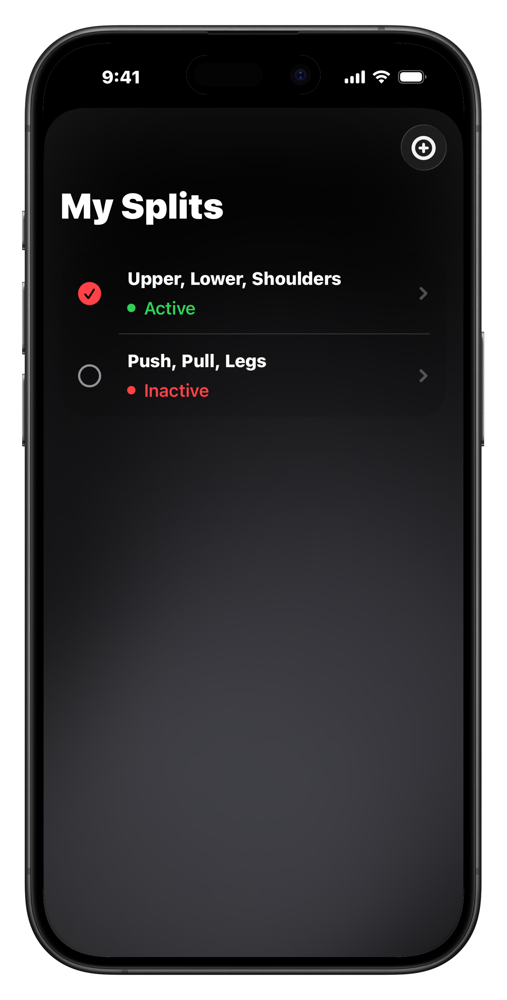
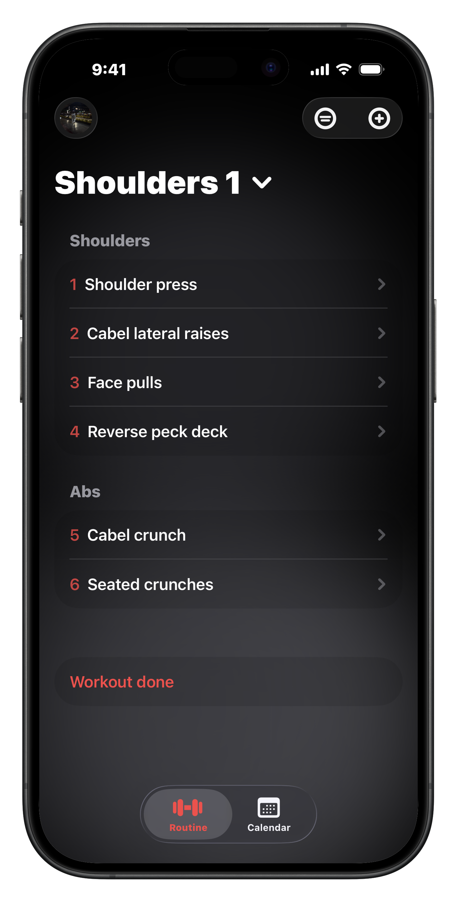
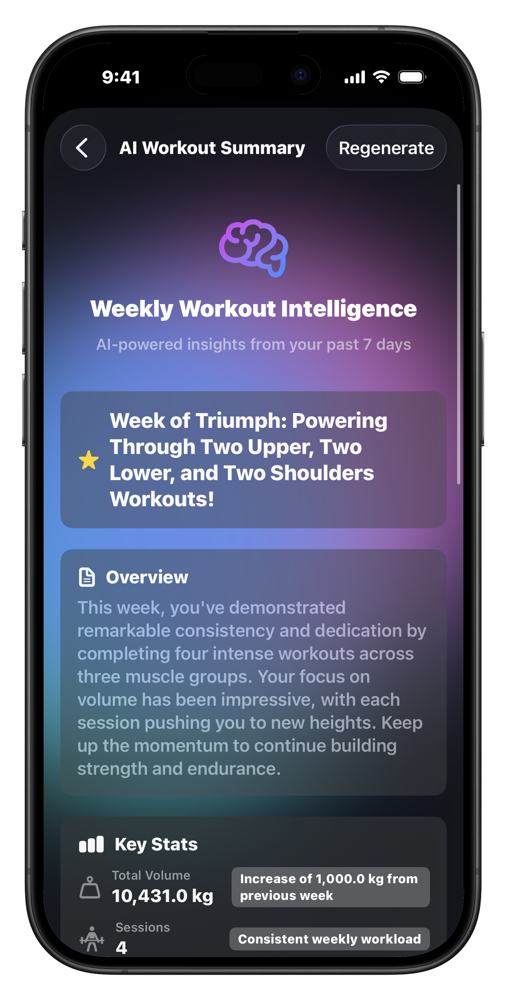
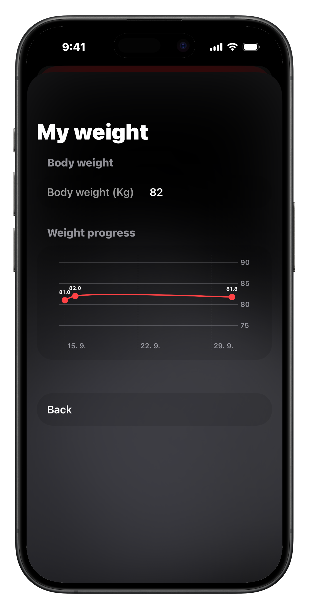
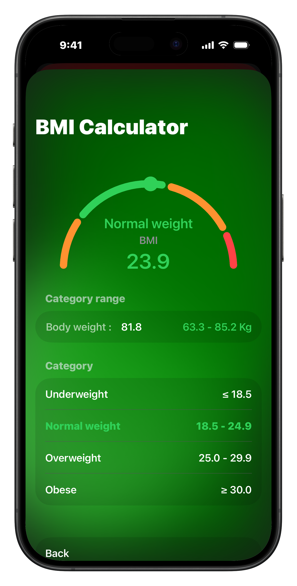
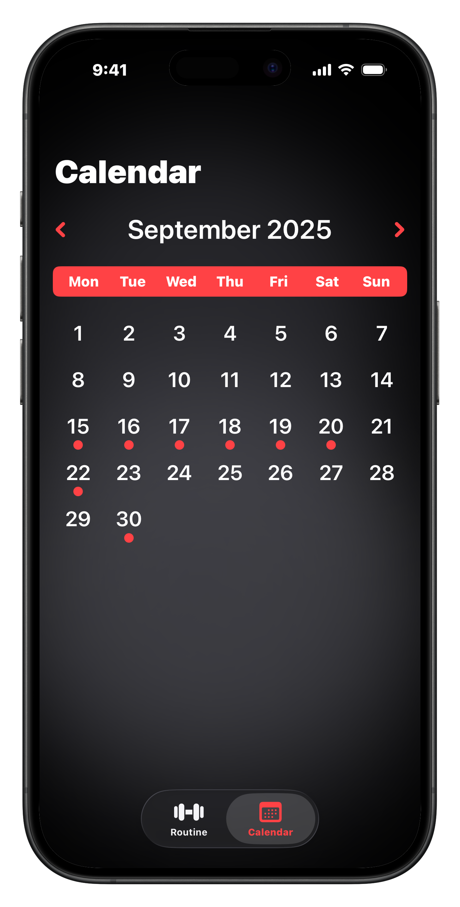
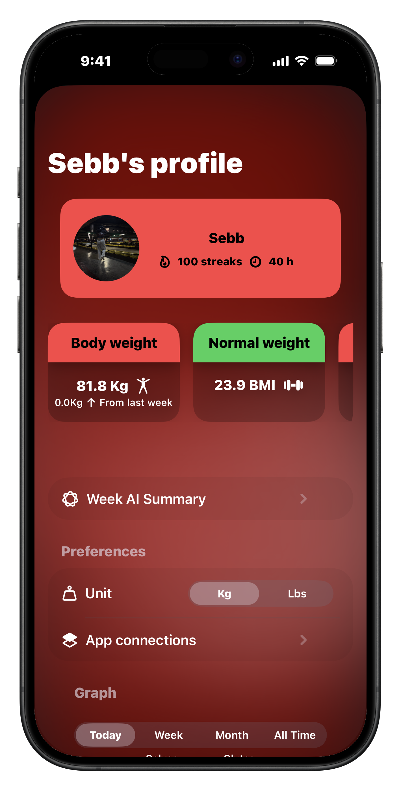
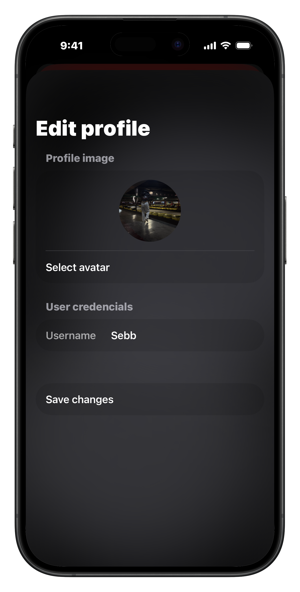

# 📱 Gymly User Guide

Welcome to **Gymly** - your complete iOS fitness tracking companion! This guide will help you make the most of all features and get started with your fitness journey.

## 🚀 Getting Started

### First Launch & Setup

1. **Sign In with Apple**
   - When you first open Gymly, you'll be prompted to sign in with your Apple ID
   - This ensures your data stays secure and synced with your Apple account
   - Grant the requested permissions for the best experience

2. **HealthKit Integration** (Optional but Recommended)
   - Navigate to Settings → Connections
   - Enable HealthKit integration to sync with Apple Health
   - This allows automatic weight tracking and workout data synchronization

3. **Profile Setup**
   - Add your profile picture in Settings
   - Enter your basic information (weight, height, age) for BMI tracking
   - Choose your preferred weight unit (kg or lbs)

## 🏋️ Creating Your First Workout Split

### What is a Workout Split?

A workout split is your complete workout routine - a collection of workout days that you'll cycle through. Common examples include:
- **Push/Pull/Legs** (3-day split)
- **Upper/Lower** (2-day split)
- **Full Body** (1-day split)
- **Bro Split** (5-6 day split focusing on individual muscle groups)

### Creating a New Split

1. **Open the Routine Tab** at the top of the screen
2. **Tap "Create New Split"** or the "+" button
3. **Enter Split Details:**
   - **Split Name:** Give your routine a memorable name (e.g., "Push Pull Legs", "Summer Cut")
   - **Number of Days:** Choose how many different workout days your split will have
   - **Start Date:** When you want to begin this routine

4. **Customize Your Days:**
   - Each day gets a default name like "Day 1", "Day 2", etc.
   - You can customize these names (e.g., "Push Day", "Pull Day", "Leg Day")

### Switching Between Splits

- You can have multiple splits saved
- Only one split can be "active" at a time
- Switch between splits in the Splits view
- Your current day in the split is automatically tracked

## 💪 Adding Exercises to Your Workout

### Creating Exercises

1. **Navigate to your current workout day**
2. **Tap "Add Exercise" (+)**
3. **Fill in Exercise Details:**
   - **Exercise Name:** Be specific (e.g., "Barbell Bench Press", not just "Bench")
   - **Sets:** How many sets you plan to do
   - **Rep Goal:** Your target reps (e.g., "8-12", "15", "AMRAP")
   - **Muscle Group:** Choose from 10 categories: Chest, Back, Biceps, Triceps, Shoulders, Quads, Hamstrings, Calves, Glutes, Abs

4. **Save the Exercise**

### Managing Exercise Sets

Each exercise contains multiple sets with detailed tracking:

#### Set Information
- **Weight:** The weight you lifted (automatically converts between kg/lbs)
- **Reps:** How many repetitions you completed
- **Type Indicators:**
  - **W:** Warm-up set
  - **F:** Failure set (couldn't complete another rep)
  - **RP:** Rest-pause set
  - **DS:** Drop set
  - **BW:** Bodyweight exercise

#### Adding/Editing Sets
- **Add Sets:** Tap the "+" next to any exercise
- **Edit Sets:** Tap on any set to modify weight, reps, or add notes
- **Delete Sets:** Swipe left on a set or tap the delete button
- **Set Notes:** Add specific notes for each set (form cues, how it felt, etc.)

## 📊 Tracking Your Progress

### Completing Workouts

1. **Mark Exercises as Complete:** Toggle the checkmark when you finish each exercise
2. **Review Your Session:** Check the workout summary
3. **Save to Calendar:** Your completed workout automatically saves to the calendar view

### Workout Analytics

#### Muscle Group Radar Chart
- Visual representation of which muscle groups you've been working
- Updates in real-time as you complete workouts
- Helps identify imbalances in your training

#### Progress Tracking
- **Weight Progression:** Track increases in weight over time
- **Volume Tracking:** Monitor total sets and reps
- **Frequency:** See how often you train each muscle group

### Calendar View

Access your complete workout history:
- **Monthly View:** See all workout days at a glance
- **Daily Details:** Tap any day to see specific exercises and sets
- **Progress Indicators:** Visual markers show which days you worked out

## ⚙️ Settings & Customization

### General Settings

#### Units & Display
- **Weight Unit:** Switch between kg and lbs
- **Round Weights:** Automatically round to nearest 2.5kg/5lbs
- **Theme:** Dark/Light mode support (follows system setting)

#### HealthKit Integration
- **Weight Sync:** Automatically import weight from Apple Health
- **Height Sync:** Import height measurements
- **Workout Export:** Send completed workouts to Apple Health
- **BMI Tracking:** Automatic BMI calculation and tracking

### Profile Management
- **Profile Picture:** Add a custom photo
- **Personal Info:** Update weight, height, age for accurate BMI
- **Privacy Controls:** Manage what data syncs with HealthKit

## 📤 Import & Export Features

### Exporting Splits
1. Go to **Splits View**
2. Select the split you want to share
3. Tap **Export**
4. Share the `.gymlysplit` file via AirDrop, Messages, or email

### Importing Splits
1. Receive a `.gymlysplit` file from someone
2. Open the file with Gymly (it should open automatically)
3. The split will be imported to your splits library
4. Switch to the new split when ready to use it

## 📅 Daily Usage Workflow

### Starting Your Workout

1. **Open Gymly** - The app automatically shows today's workout
2. **Review Your Plan** - See all exercises scheduled for today
3. **Begin First Exercise** - Tap on any exercise to start logging sets

### During Your Workout

1. **Log Each Set:**
   - Enter weight and reps after completing each set
   - Mark special set types (warm-up, failure, etc.)
   - Add notes if needed

2. **Add Sets as Needed:**
   - If you want to do more sets than planned, tap the "+" to add more
   - Remove sets you don't complete

3. **Mark Exercises Complete:**
   - Toggle the checkmark when you finish each exercise
   - This helps track your progress and completion

### After Your Workout

1. **Review Session Summary:**
   - See total workout time
   - Review all completed exercises and sets
   - Check your muscle group distribution

2. **Save to History:**
   - Your workout automatically saves to the calendar
   - All data syncs with HealthKit (if enabled)

## 🎯 Pro Tips for Maximum Results

### Exercise Organization
- **Be Consistent with Names:** Use the same exercise names each time for better progress tracking
- **Use Specific Names:** "Incline Dumbbell Press" vs. "Chest Press"
- **Muscle Group Accuracy:** Assign exercises to the primary muscle group worked

### Progressive Overload
- **Track Everything:** Log all sets, even warm-ups
- **Review Previous Sessions:** Use the calendar to see your last performance
- **Gradual Increases:** Aim for small, consistent improvements

### Split Programming
- **Balance Muscle Groups:** Aim for roughly equal volume across pushing/pulling movements
- **Recovery Time:** Allow adequate rest between training the same muscle groups
- **Progression:** Gradually increase volume or intensity over time

### Data Management
- **Regular Backups:** Export your favorite splits periodically
- **Clean Data:** Remove or modify exercises that no longer serve you
- **Health Sync:** Keep HealthKit integration enabled for comprehensive health tracking

## ❓ Troubleshooting & FAQ

### Common Issues

**Q: My workout didn't save to the calendar**
- A: Make sure you marked at least one exercise as complete and press **Workout done** button before leaving the workout

**Q: HealthKit isn't syncing**
- A: Go to Settings → Connections and re-enable HealthKit permissions
- Check that Health app has the necessary permissions

**Q: I can't edit my set data**
- A: Tap directly on the weight or reps numbers to edit them

**Q: The app forgot my current day in the split**
- A: This may happen if you don't open the app for several days. The app automatically advances your split based on the calendar

**Q: My exported split won't open**
- A: Make sure the recipient has Gymly installed and the file has the .gymlysplit extension

### Performance Tips

- **Regular App Updates:** Keep Gymly updated for the best performance
- **Storage Management:** Old workout data is preserved but consider exporting very old splits
- **Battery Usage:** Enable Low Power Mode during long workouts to preserve battery

### Data Safety

- **iCloud Sync:** Your data is tied to your Apple ID and stored locally
- **Backup Strategy:** Regularly export important splits as backups
- **Privacy:** Your workout data stays on your device and in Apple's ecosystem

## 🔄 App Updates & New Features

Gymly is actively developed with regular updates that include:
- **Bug Fixes:** Improved stability and performance
- **New Features:** Enhanced tracking capabilities
- **UI Improvements:** Better user experience
- **HealthKit Enhancements:** Deeper integration with Apple Health

### Providing Feedback

Found a bug or have a feature request?
- **Email:** [sebastian.kucera@icloud.com](mailto:sebastian.kucera@icloud.com)
- **TestFlight:** Join the beta program for early access to new features

## 🏆 Advanced Usage

### Custom Workout Planning

Create specialized splits for different goals:
- **Strength Focus:** Lower rep ranges, longer rest periods
- **Hypertrophy:** Moderate rep ranges, moderate rest
- **Endurance:** Higher rep ranges, shorter rest
- **Sport-Specific:** Exercises tailored to your sport

### Analytics Deep Dive

Use the data to optimize your training:
- **Volume Trends:** Track total weekly volume
- **Frequency Analysis:** Ensure balanced muscle group training
- **Progressive Overload:** Monitor strength increases over time
- **Recovery Patterns:** Identify optimal rest days

---

**Ready to get started?** Open Gymly and create your first split! Remember, consistency is key to seeing results. Track every workout, stay committed to your routine, and watch your progress unfold in the calendar view.

**Happy training! 💪**
